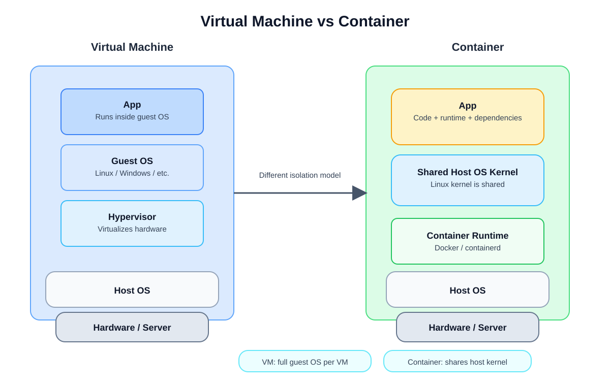

# Container
A container is a lightweight, isolated package that contains an application, its code, runtime, libraries, and configuration files so it can run consistently across environments.

Think of it like a shipping box: the app and everything it needs are packed together, so it can move from one machine to another without breaking.

## Why containers are useful
- Portability: the same app runs the same way on a laptop, server, or cloud machine.
- Consistency: fewer "works on my machine" problems.
- Speed: containers are lighter and start faster than full virtual machines.
- Scalability: multiple containers can run the same service at once.

## Example
If a Python app depends on Python, Flask, environment variables, and config files, those can all be bundled into one container. Then that container can run anywhere Docker is available.

## Container vs Virtual Machine
A virtual machine includes a full guest operating system. A container shares the host OS kernel, so it is much lighter.

- VM: heavier, slower, more resources used
- Container: lighter, faster, more efficient

## Container vs VM Diagram




## In Docker
Docker is the most common tool used to build and run containers.

A typical flow is:
1. Build an image
2. Run a container from that image
3. The app runs inside the container


## Dockerfile
A Dockerfile is a text file that contains instructions for building a Docker image. It tells Docker what base OS to use, which files to copy, which commands to run, and how to start the application. It is the template to build a docker images.

Example:
```dockerfile
FROM python:3.11-slim
WORKDIR /app
COPY . .
RUN pip install -r requirements.txt
CMD ["python", "app.py"]
```

This file is like a recipe for creating an application environment.

## Docker Image
A Docker image is a read-only package that contains everything needed to run an app: the code, dependencies, libraries, and runtime. It is built from a Dockerfile and acts as the template used to create containers.

Think of it like this:
- Dockerfile = recipe
- Docker image = final packaged product
- Docker container = running instance of that image

## Dockerfile vs Image vs Container
- Dockerfile: instructions to build the app environment
- Docker image: built artifact created from the Dockerfile
- Container: running process created from the image

## Creating an Image from a Dockerfile
1. Create a file named `Dockerfile` in your project folder.
2. Write the instructions for the app environment.
3. Run the build command:

```bash
docker build -t myapp:latest .
```

This command builds an image named `myapp:latest` from the Dockerfile in the current directory.

## Creating and Running a Container from an Image
After the image is built, run it as a container:

```bash
docker run -d -p 8000:8000 --name myapp-container myapp:latest
```

Explanation:
- `-d` = run in detached mode
- `-p 8000:8000` = map host port 8000 to container port 8000
- `--name myapp-container` = give the container a name
- `myapp:latest` = the image to run

## Docker Volume
A Docker volume is a persistent storage area used by containers. It keeps data even when the container is stopped or removed. This is useful for databases, uploaded files, logs, and application data that should survive container restarts.

Example:
```bash
docker volume create mydata
```

A volume is stored outside the container filesystem, so the data persists independently of the container lifecycle.

## Mount Point
A mount point is the path inside a container where a storage location is attached. For example, you can mount a local folder or a Docker volume to a path inside the container such as `/app/data` or `/var/lib/mysql`.

Example:
```bash
docker run -v mydata:/var/lib/mysql mysql
```

This means the container uses the Docker volume `mydata` at the mount point `/var/lib/mysql`.

## Difference Between Docker Volume and Mount Point
- A Docker volume is the actual storage resource that holds the data.
- A mount point is the location inside the container where that storage is attached.

In simple terms:
- volume = the storage itself
- mount point = where the storage is connected in the container filesystem

## Example with Volume and Mount Point
```bash
docker volume create app-data
docker run -d -p 8000:8000 -v app-data:/app/data --name myapp-container myapp:latest
```

This keeps app data in the Docker volume even if the container is recreated.

## Docker Registry
A Docker registry is a storage and distribution service for Docker images. It is where images are stored so they can be pushed, pulled, and shared across machines or teams.

Examples of registries:
- Docker Hub (public registry)
- GitHub Container Registry (GHCR)
- Amazon ECR
- Azure Container Registry

### Why use a registry?
- Share images with other developers
- Deploy the same image in multiple environments
- Store private images securely

### Typical workflow
```bash
docker build -t myapp:latest .
docker tag myapp:latest mydockerhubuser/myapp:latest
docker push mydockerhubuser/myapp:latest
```

Then on another machine:
```bash
docker pull mydockerhubuser/myapp:latest
```

Think of a registry like a central library for Docker images: it stores the image and lets others download it when needed.

## Docker Network
A Docker network is a virtual networking layer that allows containers to communicate with each other and with the outside world. Containers are usually isolated by default, so Docker networking gives them a way to connect in a controlled way.

Docker creates a default bridge network for containers unless you specify another network type.

### How Docker networking works
Each container gets its own network namespace and an IP address on the network. Docker uses network drivers to manage communication between containers and the host machine.

Containers on the same network can talk to each other by container name or IP address. Docker handles the routing and port mapping needed for traffic.

## Types of Docker Networks
### 1. Bridge network
This is the default network type in Docker. Containers on the same bridge network can communicate with each other, while still being isolated from other networks.

Example:
```bash
docker network create mybridge
```

Then run containers on that network:
```bash
docker run -d --name app1 --network mybridge nginx
docker run -d --name app2 --network mybridge nginx
```

Containers can reach each other using their container names, such as `app1` or `app2`.

### 2. Host network
In host networking, the container shares the host machine's network stack. It does not get its own separate IP address. This is useful for performance-sensitive workloads, but it is less isolated.

Example:
```bash
docker run --network host nginx
```

### 3. None network
A container with the `none` network has no network interface at all. It cannot communicate with other containers or the outside world.

Example:
```bash
docker run --network none nginx
```

### 4. Overlay network
Overlay networks are used for communication between containers across multiple Docker hosts, such as in Docker Swarm or Kubernetes clusters. This allows containers on different machines to communicate as if they are on the same network.

Example:
```bash
docker network create --driver overlay myoverlay
```

## Container Communication
Containers communicate through the network layer using IP addresses and ports.

Example:
```bash
docker run -d --name web -p 8080:80 nginx
docker run -d --name db redis
```

If the app container wants to talk to the database container, it uses the database container's service name or IP address, for example:
```bash
redis://db:6379
```

### Port mapping
When you expose an app port from a container to the host, Docker maps the host port to the container port:
```bash
docker run -p 8080:80 nginx
```

This means:
- outside machine: port 8080
- inside container: port 80

### Same-network communication
If two containers are on the same Docker network, they can communicate directly without manually exposing ports to the host. This is commonly used in multi-container applications such as web + database setups.

### Why networking matters
Networking is essential for:
- communication between containers
- connecting apps to databases
- exposing services to the host or internet
- scaling microservices

In short, a container is a portable, isolated runtime environment for software.
